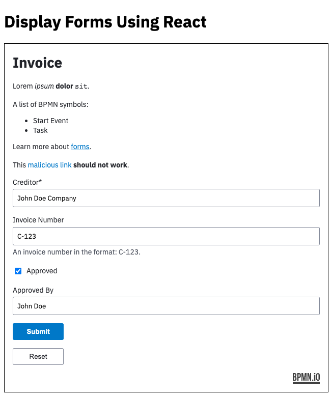

# @bpmn-io/react-form-js Example

An example how to use [@bpmn-io/react-form-js](../) to display a form in a React app.




## Run the Example

To run the example:

```
npm install
npm start
```

This puts up the example to [http://localhost:3000](http://localhost:3000).


## License

MIT